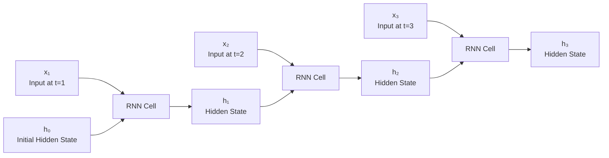
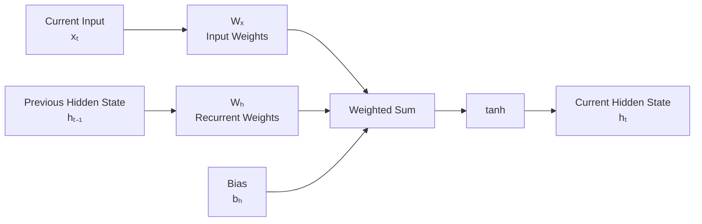
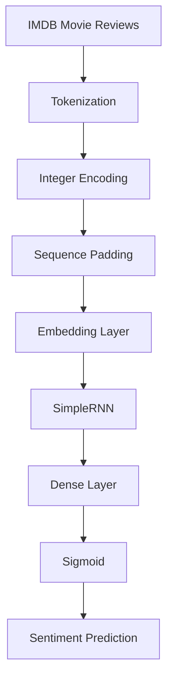
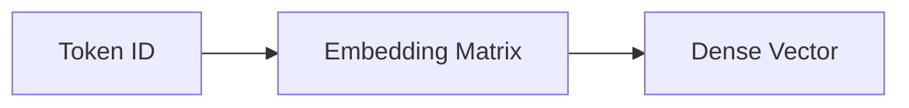
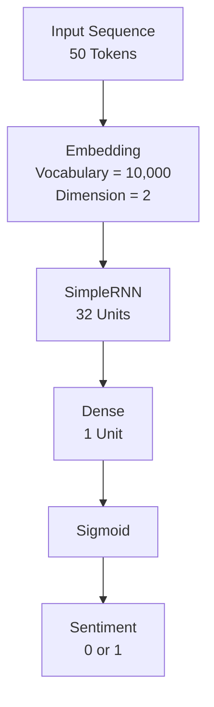
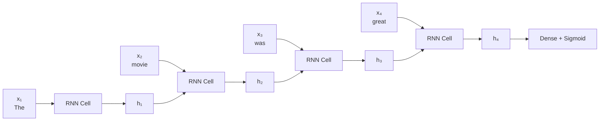
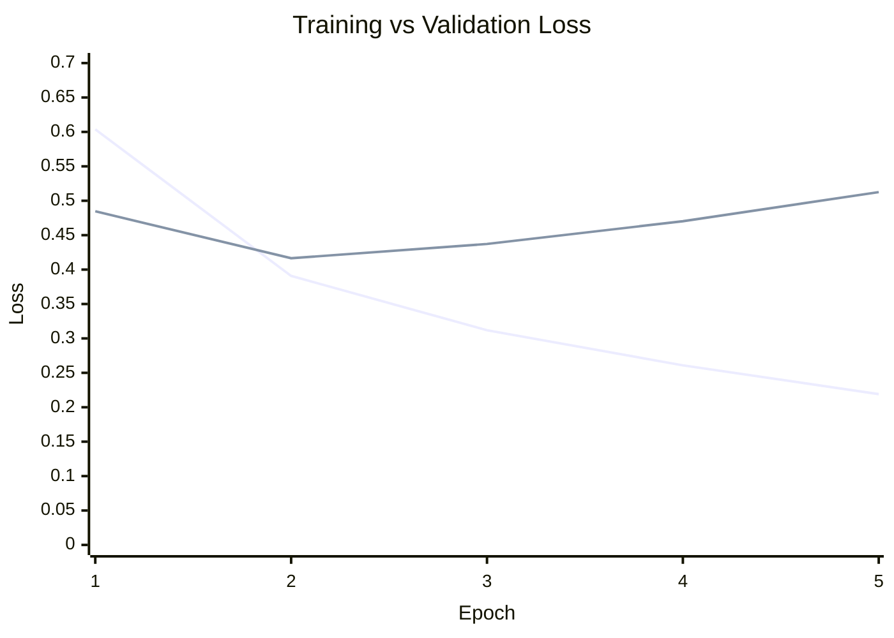
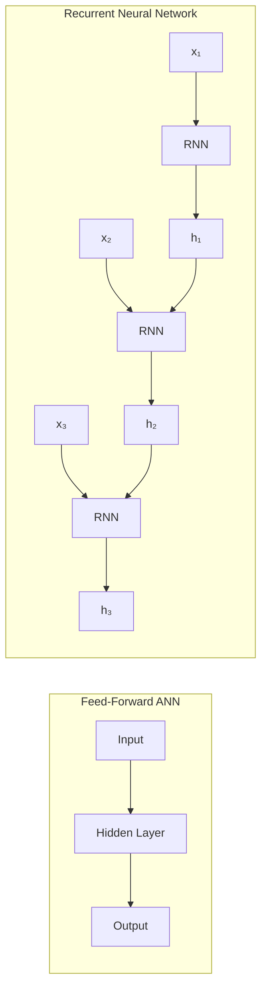
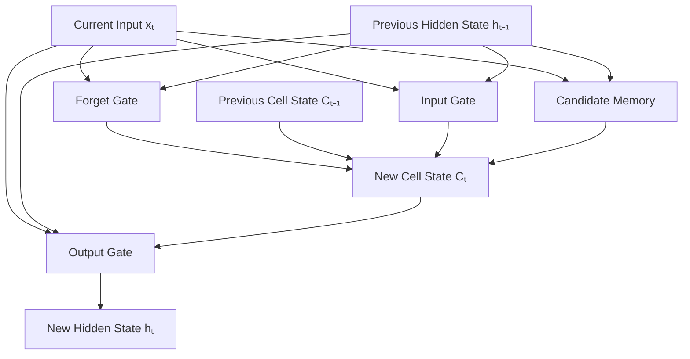

# Recurrent Neural Networks: Architecture and Sentiment Analysis

A practical implementation and study of Recurrent Neural Networks (RNNs) using TensorFlow and Keras.

This repository focuses on understanding the internal mechanics of recurrent architectures and applying a `SimpleRNN` to sentiment classification using text data.

---

## Table of Contents

* [Overview](#overview)
* [Repository Structure](#repository-structure)
* [RNN Architecture](#rnn-architecture)
* [SimpleRNN Dimensions](#simplernn-dimensions)
* [RNN Computation](#rnn-computation)
* [Parameter Sharing Across Timesteps](#parameter-sharing-across-timesteps)
* [Parameter Calculation](#parameter-calculation)
* [Sentiment Analysis Pipeline](#sentiment-analysis-pipeline)
* [Text Preprocessing](#text-preprocessing)
* [Sequence Padding](#sequence-padding)
* [Embedding Layer](#embedding-layer)
* [Model Architecture](#model-architecture)
* [Model Dimensions](#model-dimensions)
* [Model Parameters](#model-parameters)
* [Training Configuration](#training-configuration)
* [Training Results](#training-results)
* [Training vs Validation Performance](#training-vs-validation-performance)
* [RNN vs Feed-Forward ANN](#rnn-vs-feed-forward-ann)
* [RNN to LSTM](#rnn-to-lstm)
* [Technical Stack](#technical-stack)
* [Installation](#installation)
* [Keras Implementation](#keras-implementation)
* [Key Learning Outcomes](#key-learning-outcomes)
* [Future Work](#future-work)
* [Author](#author)

---

## Overview

A conventional feed-forward neural network processes an input through a fixed sequence of layers.

An RNN is designed for sequential data where the order of inputs matters.

Instead of processing every input independently, an RNN maintains a hidden state that is passed from one timestep to the next.

The fundamental recurrence is:

$$
h_t = \tanh(x_tW_x + h_{t-1}W_h + b_h)
$$

Where:

* $x_t$ = input at timestep $t$
* $h_{t-1}$ = hidden state from the previous timestep
* $W_x$ = input-to-hidden weight matrix
* $W_h$ = hidden-to-hidden recurrent weight matrix
* $b_h$ = hidden-state bias
* $h_t$ = current hidden state

The key idea is:

$$
h_{t-1} \rightarrow h_t
$$

The previous hidden state carries information from earlier timesteps into the current computation.

---

## Repository Structure

```text
RNN-Architecture/
│
├── RNN-Architecture.ipynb
│
└── Sentiment-Analysis/
    └── Sentiment-analysis-using-RNN.ipynb
```

### `RNN-Architecture.ipynb`

This notebook focuses on understanding the internal architecture of a `SimpleRNN`.

Topics covered:

* RNN architecture
* Timesteps
* Hidden states
* Input-to-hidden connections
* Hidden-to-hidden recurrent connections
* Weight matrix dimensions
* Bias vectors
* Parameter calculations
* Keras `SimpleRNN` implementation

### `Sentiment-Analysis/Sentiment-analysis-using-RNN.ipynb`

This notebook implements sentiment classification using the IMDB movie-review dataset.

Topics covered:

* Text tokenization
* Vocabulary construction
* Integer encoding
* Sequence generation
* Padding
* Word embeddings
* SimpleRNN
* Binary classification
* Model training
* Validation
* Overfitting analysis

---

## RNN Architecture

The defining characteristic of an RNN is the propagation of the hidden state from one timestep to the next.



The sequence of hidden states is:

$$
h_0 \rightarrow h_1 \rightarrow h_2 \rightarrow h_3 \rightarrow \cdots
$$

The same recurrent parameters are reused at every timestep.

---

## SimpleRNN Dimensions

The architecture notebook uses the following configuration:

| Component      | Value |
| -------------- | ----: |
| Input features |     5 |
| Timesteps      |     4 |
| RNN units      |     3 |
| Output units   |     1 |

For every timestep, the input contains 5 features:

$$
x_t \in \mathbb{R}^{1 \times 5}
$$

The hidden state contains 3 values:

$$
h_t \in \mathbb{R}^{1 \times 3}
$$

Therefore, the input-to-hidden weight matrix has shape:

$$
W_x \in \mathbb{R}^{5 \times 3}
$$

The recurrent weight matrix has shape:

$$
W_h \in \mathbb{R}^{3 \times 3}
$$

The hidden-state bias has shape:

$$
b_h \in \mathbb{R}^{1 \times 3}
$$

The complete input sequence has the shape:

```text
(4, 5)
```

where:

* `4` = number of timesteps
* `5` = number of input features per timestep

---

## RNN Computation

At every timestep, the current input and previous hidden state are combined.



The mathematical formulation is:

$$
h_t = \tanh(x_tW_x + h_{t-1}W_h + b_h)
$$

### Shape Calculation

Current input:

$$
x_t = (1 \times 5)
$$

Input-to-hidden weights:

$$
W_x = (5 \times 3)
$$

Therefore:

$$
x_tW_x = (1 \times 5)(5 \times 3)
$$

$$
= (1 \times 3)
$$

Previous hidden state:

$$
h_{t-1} = (1 \times 3)
$$

Recurrent weights:

$$
W_h = (3 \times 3)
$$

Therefore:

$$
h_{t-1}W_h = (1 \times 3)(3 \times 3)
$$

$$
= (1 \times 3)
$$

The bias also has shape:

$$
b_h = (1 \times 3)
$$

Therefore, all three terms can be added:

$$
x_tW_x + h_{t-1}W_h + b_h
$$

resulting in:

$$
(1 \times 3)
$$

After applying `tanh`:

$$
h_t = (1 \times 3)
$$

---

## Parameter Sharing Across Timesteps

One of the most important characteristics of an RNN is that the same trainable parameters are reused at every timestep.

```text
t = 1
x₁ → Wₓ
h₀ → Wₕ

t = 2
x₂ → Wₓ
h₁ → Wₕ

t = 3
x₃ → Wₓ
h₂ → Wₕ

t = 4
x₄ → Wₓ
h₃ → Wₕ
```

There is only one:

$$
W_x
$$

one:

$$
W_h
$$

and one:

$$
b_h
$$

These parameters are shared across all timesteps.

Only the hidden state changes:

$$
h_0 \rightarrow h_1 \rightarrow h_2 \rightarrow h_3 \rightarrow h_4
$$

This parameter sharing is one of the defining characteristics of recurrent architectures.

---

## Parameter Calculation

For a `SimpleRNN`:

* Input features = 5
* RNN units = 3

The trainable parameters consist of:

1. Input-to-hidden weights
2. Hidden-to-hidden recurrent weights
3. Hidden-state bias

### Input-to-hidden weights

$$
5 \times 3 = 15
$$

### Recurrent weights

$$
3 \times 3 = 9
$$

### Bias

$$
3
$$

### Total RNN Parameters

$$
15 + 9 + 3 = 27
$$

The general formula is:

$$
\text{RNN Parameters}
=====================

\text{units}
\times
(\text{input features}+\text{units}+1)
$$

For this architecture:

$$
3 \times (5+3+1)
$$

$$
=3 \times 9
$$

$$
=\boxed{27}
$$

---

## Dense Output Layer

The RNN produces a hidden representation containing 3 values.

The Dense layer contains one output neuron.

```text
RNN Output
    ↓
[h₁ h₂ h₃]
    ↓
Dense(1)
    ↓
Output
```

The Dense layer therefore contains:

$$
3 \times 1 + 1 = 4
$$

parameters.

The additional `1` represents the Dense-layer bias.

Therefore, the complete architecture contains:

$$
27 + 4 = \boxed{31}
$$

trainable parameters.

The Keras model summary confirms:

```text
SimpleRNN    27 parameters
Dense         4 parameters
--------------------------
Total        31 parameters
```

---

## Sentiment Analysis Pipeline

The second notebook applies the RNN architecture to binary sentiment classification using the IMDB movie-review dataset.



The complete pipeline is:

```text
Raw Review
    ↓
Tokenization
    ↓
Integer Encoding
    ↓
Padding
    ↓
Embedding
    ↓
SimpleRNN
    ↓
Dense
    ↓
Sigmoid
    ↓
Binary Sentiment
```

---

## Text Preprocessing

The first step is converting natural language into numerical representations.

For example:

```text
"python is great"
```

may be converted into:

```text
[2, 4, 5]
```

where each integer represents a token in the vocabulary.

The model does not directly process the original words.

It processes numerical token representations.

---

## Vocabulary

The tokenizer creates a mapping between words and integer IDs.

For example:

```text
python → 2
is     → 4
great  → 5
```

Each word is therefore represented by an integer token ID.

For the IMDB implementation, the vocabulary is limited to:

```text
10,000 words
```

---

## Sequence Padding

Different movie reviews have different lengths.

For example:

```text
Review 1 → [12, 45, 67]

Review 2 → [8, 91, 23, 41, 76, 55]

Review 3 → [17, 32]
```

A neural network requires consistent tensor dimensions.

Therefore, the sequences are padded to a fixed length of:

$$
\boxed{50}
$$

The resulting training dataset has the shape:

$$
\boxed{(25000,50)}
$$

This represents:

* 25,000 training samples
* 50 tokens per sample

For example:

```text
[12, 45, 67]
```

becomes:

```text
[12, 45, 67, 0, 0, ..., 0]
```

when using post-padding.

Padding allows all sequences to be represented as a single tensor with a consistent shape.

---

## Embedding Layer

Integer token IDs are discrete values and do not directly capture semantic relationships between words.

The Embedding layer converts each token ID into a dense vector.



The model uses:

| Parameter           |  Value |
| ------------------- | -----: |
| Vocabulary size     | 10,000 |
| Embedding dimension |      2 |
| Sequence length     |     50 |

Therefore:

```text
Token sequence
(50,)
      ↓
Embedding
      ↓
(50, 2)
```

For an entire batch:

$$
(\text{batch size},50)
\rightarrow
(\text{batch size},50,2)
$$

Each token is represented by a vector of size `2`.

---

## Embedding Parameters

The embedding matrix has:

$$
10000 \times 2
$$

parameters.

Therefore:

$$
\boxed{20,000}
$$

trainable parameters.

---

## Model Architecture

The final sentiment classification model consists of:

```text
Input
  ↓
Embedding(10000, 2)
  ↓
SimpleRNN(32)
  ↓
Dense(1, sigmoid)
  ↓
Sentiment Probability
```

The architecture can be represented as:



---

## Model Dimensions

The model processes the data through the following shapes.

### Input

$$
(batch\ size,50)
$$

### After Embedding

$$
(batch\ size,50,2)
$$

### After SimpleRNN

The RNN uses:

```python
return_sequences=False
```

Therefore, it returns only the final hidden state.

The output shape is:

$$
(batch\ size,32)
$$

### After Dense

$$
(batch\ size,1)
$$

### Final Prediction

The sigmoid activation produces a probability:

$$
0 \leq p \leq 1
$$

For example:

```text
0.91 → Positive
0.08 → Negative
```

A threshold of `0.5` can be used for binary classification.

---

## Model Parameters

The sentiment model contains three trainable layers.

### Embedding

$$
10000 \times 2 = 20000
$$

parameters.

### SimpleRNN

The input feature dimension entering the RNN is `2` because the Embedding layer outputs vectors of size `2`.

The RNN contains 32 units.

Therefore:

$$
32 \times (2+32+1)
$$

$$
=32\times35
$$

$$
=1120
$$

parameters.

### Dense

The Dense layer receives 32 values and contains one neuron:

$$
32\times1+1
$$

$$
=33
$$

parameters.

### Total

$$
20000+1120+33
$$

$$
=\boxed{21153}
$$

trainable parameters.

---

## Sequence Processing

Consider a simplified sentence:

```text
"The movie was great"
```

After tokenization and embedding, each word becomes a numerical vector.

The RNN processes these vectors sequentially.



At every timestep:

$$
x_t + h_{t-1}
\rightarrow
h_t
$$

More precisely:

$$
h_t =
\tanh(x_tW_x+h_{t-1}W_h+b_h)
$$

The previous hidden state carries information from earlier tokens.

---

## Training Configuration

The model is compiled using:

```python
model.compile(
    loss="binary_crossentropy",
    optimizer="adam",
    metrics=["accuracy"]
)
```

The model is trained for 5 epochs.

The main metrics tracked are:

* Training loss
* Training accuracy
* Validation loss
* Validation accuracy

---

## Training Results

The observed training history was:

| Epoch | Training Accuracy | Validation Accuracy | Training Loss | Validation Loss |
| ----: | ----------------: | ------------------: | ------------: | --------------: |
|     1 |            64.36% |              77.10% |        0.6037 |          0.4847 |
|     2 |            83.07% |              81.17% |        0.3908 |          0.4165 |
|     3 |            87.30% |              80.71% |        0.3119 |          0.4372 |
|     4 |            89.78% |              78.92% |        0.2609 |          0.4702 |
|     5 |            91.66% |              79.52% |        0.2191 |          0.5125 |

---

## Training vs Validation Performance

### Training Accuracy

```mermaid
xychart-beta
    title "Training Accuracy"
    x-axis "Epoch" [1, 2, 3, 4, 5]
    y-axis "Accuracy" 0.5 --> 1.0
    line [0.6436, 0.8307, 0.8730, 0.8978, 0.9166]
```

Training accuracy increases consistently:

$$
64.36% \rightarrow 91.66%
$$

This indicates that the model is learning the training data effectively.

### Validation Accuracy

```mermaid
xychart-beta
    title "Validation Accuracy"
    x-axis "Epoch" [1, 2, 3, 4, 5]
    y-axis "Accuracy" 0.5 --> 1.0
    line [0.7710, 0.8117, 0.8071, 0.7892, 0.7952]
```

The highest validation accuracy occurs at epoch 2:

$$
\boxed{81.17%}
$$

After that, validation accuracy begins to decline.

### Training vs Validation Loss



Training loss continuously decreases:

$$
0.6037 \rightarrow 0.2191
$$

while validation loss begins increasing after epoch 2.

This indicates that the model is becoming increasingly specialized to the training data while its generalization performance is not improving.

This is evidence of overfitting.

For a production-quality model, techniques such as early stopping, dropout, recurrent dropout, or a more suitable architecture could be explored.

---

## RNN vs Feed-Forward ANN

A conventional feed-forward neural network processes information in one direction:

```text
Input → Hidden Layers → Output
```

There is no recurrent state connecting different timesteps.

An RNN introduces a hidden-state connection across timesteps.



The key difference is:

$$
h_{t-1}\rightarrow h_t
$$

This allows information from previous timesteps to influence the current timestep.

---

## RNN to LSTM

A SimpleRNN maintains a single hidden state:

$$
h_t
$$

An LSTM maintains two states:

$$
h_t = \text{hidden state}
$$

$$
C_t = \text{cell state}
$$

The cell state provides a dedicated pathway for long-term information.

LSTMs introduce gates that control information flow.



The progression is:

```text
SimpleRNN
    ↓
LSTM / GRU
    ↓
Attention
    ↓
Transformers
```

The SimpleRNN implementation in this repository therefore serves as a foundation for understanding more advanced sequence architectures.

---

## Technical Stack

* Python
* TensorFlow
* Keras
* NumPy
* Jupyter Notebook
* IMDB Dataset
* Git
* GitHub

---

## Installation

Clone the repository:

```bash
git clone https://github.com/harkirat-data/RNN-Architecture.git
cd RNN-Architecture
```

Install the required dependencies:

```bash
pip install tensorflow numpy jupyter
```

Launch Jupyter Notebook:

```bash
jupyter notebook
```

Then open:

```text
RNN-Architecture.ipynb
```

or:

```text
Sentiment-Analysis/Sentiment-analysis-using-RNN.ipynb
```

---

## Keras Implementation

A modern Keras implementation of the sentiment model is:

```python
from keras import Input
from keras.models import Sequential
from keras.layers import Embedding, SimpleRNN, Dense

model = Sequential([
    Input(shape=(50,)),
    Embedding(
        input_dim=10000,
        output_dim=2
    ),
    SimpleRNN(32),
    Dense(1, activation="sigmoid")
])

model.summary()
```

Using an explicit `Input` layer is preferred over passing `input_shape` directly to the first layer in a `Sequential` model.

---

## Key Learning Outcomes

### Recurrent Neural Networks

* Sequential data processing
* Timesteps
* Hidden states
* Recurrent connections
* Input-to-hidden transformations
* Hidden-to-hidden transformations
* Parameter sharing
* RNN parameter calculations

### Natural Language Processing

* Tokenization
* Vocabulary construction
* Integer encoding
* Sequence generation
* Sequence padding
* Word embeddings

### Deep Learning

* SimpleRNN
* Sigmoid activation
* Binary classification
* Binary crossentropy
* Adam optimizer
* Training and validation
* Overfitting analysis

---

## Future Work

Potential extensions to this repository include:

* Compare SimpleRNN with LSTM
* Compare SimpleRNN with GRU
* Experiment with different embedding dimensions
* Experiment with different sequence lengths
* Add dropout
* Add recurrent dropout
* Implement early stopping
* Tune learning rate
* Compare different optimizers
* Add precision, recall, and F1-score
* Visualize training history using Matplotlib
* Build an inference interface
* Compare recurrent models with Transformer-based architectures

---

## Author

**Harkirat Singh**

B.Tech CSE — Data Science

Learning progression:

```text
Machine Learning
       ↓
Deep Learning
       ↓
Sequence Models
       ↓
Natural Language Processing
       ↓
ML Engineering / MLOps
```

---

## Repository Purpose

This repository is part of a structured Deep Learning learning journey.

The primary objective is to understand the mechanics behind recurrent neural networks rather than treating the RNN as a black-box layer.

The implementation focuses on:

$$
\boxed{
\text{Input}
\rightarrow
\text{Hidden State}
\rightarrow
\text{Recurrent State}
\rightarrow
\text{Output}
}
$$

and extends these concepts to practical NLP sentiment classification.

The repository provides the foundation for progressing from basic recurrent architectures toward LSTMs, GRUs, attention mechanisms, and Transformer-based models.
